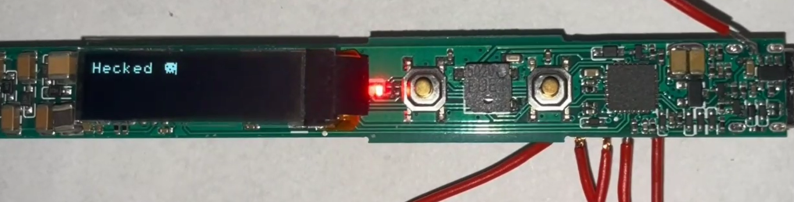

This is a Keil uVision project with the base generated on [MFANG online platform](https://mfang2.fmdevelopers.com.cn) with the following configuration:

|Pin#|GPIO|  Function  |Config|
|----|----|------------|------|
|1   |PD8 | SWD SWDIO  |
|2   |NRST| SWD RST    |
|3   |PA13| OLED RST   |output
|... |... |...         |
|24  |PD9 | LED1(red)  |output
|25  |PD10| LED2(green)|output
|... |... |...         |
|29  |PD11|RCC_FOUT0 clock|
|30  |PD0 |OLED SDA    |output
|31  |PD1 |OLED SCL    |output
|32  |PD7 |SWD SWCLK   |

Currently I can:
-   control the OLED over bit-banged I2C (WIP- needs more polishing)
-   blink LEDs

