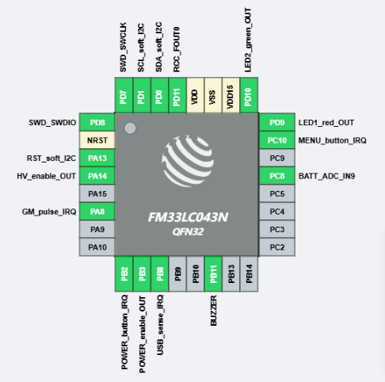

This is a Keil uVision project with the base generated on [MFANG online platform](https://mfang2.fmdevelopers.com.cn) with the following configuration:

|Pin#|GPIO|  Function  |Config|
|----|----|------------|------|
|1   |**PD8** | SWD SWDIO  |
|2   |**NRST**| Global Reset|
|3   |**PA13**| OLED Reset |output, internal pull-up
|4   |**PA14**|HV PSU? | output, internal pull-down
|6   |**PA8** |GM pulse| input, external pull-up
|9   |**PB2** |PWR button (WKUP2)| WKUP2, internal pull-up, falling edge
|10  |**PB3** |PWR Enable  | output, internal pull-down
|11  |**PB8** |USB sense   | input, internal pull-down
|14  |**PB11**|BUZZER  | output, internal pull-down
|21  |**PC8** |BATT voltage| input, ADC_IN9
|23  |**PC10**|MENU button |input, internal pull-up
|24  |**PD9** | LED1(red)  |output, internal pull-down
|25  |**PD10**| LED2(green)|output, interanl pull-down
|29  |**PD11**|RCC_FOUT0 (clock frequency output)|
|30  |**PD0** |OLED SDA    |output, open drain, external pull-up
|31  |**PD1** |OLED SCL    |output, open drain, external pull-up
|32  |**PD7** |SWD SWCLK   |

Currently I can:
-   control the OLED over bit-banged I2C 
-   blink LEDs
-   use buttons GPIO inputs
-   control Buzzer (clicks and beeps)
-   sample battery voltage
-   sample internal temperature

https://github.com/user-attachments/assets/4a36b4d5-3909-4819-be21-2b176fe915f6

